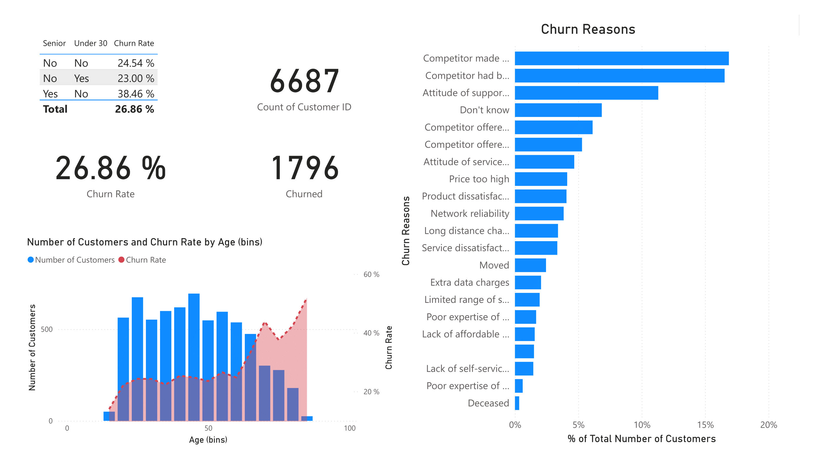
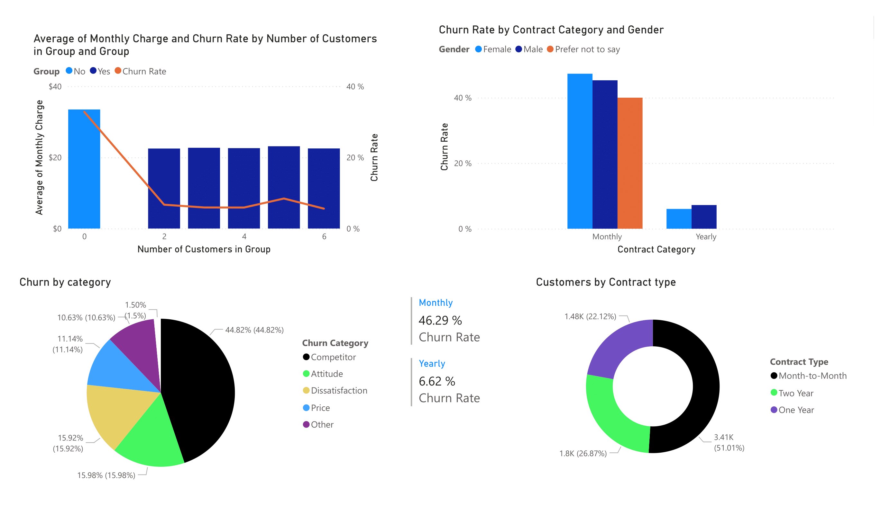
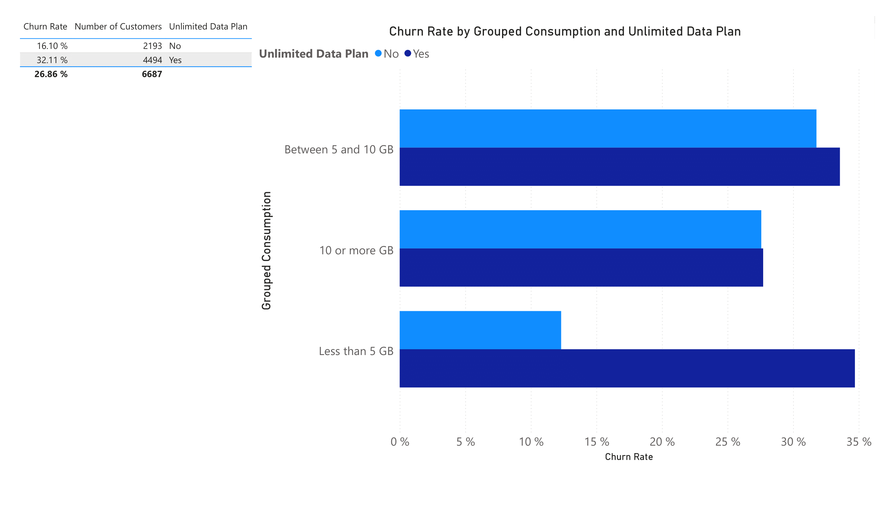
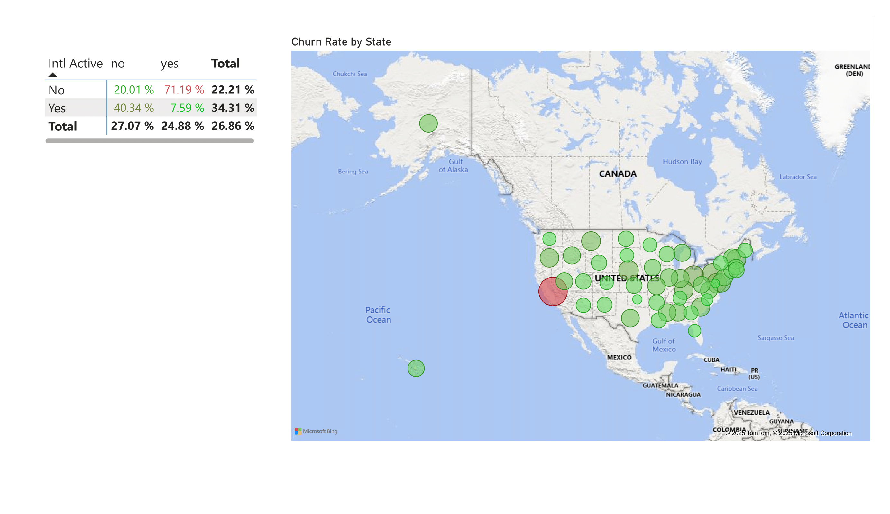
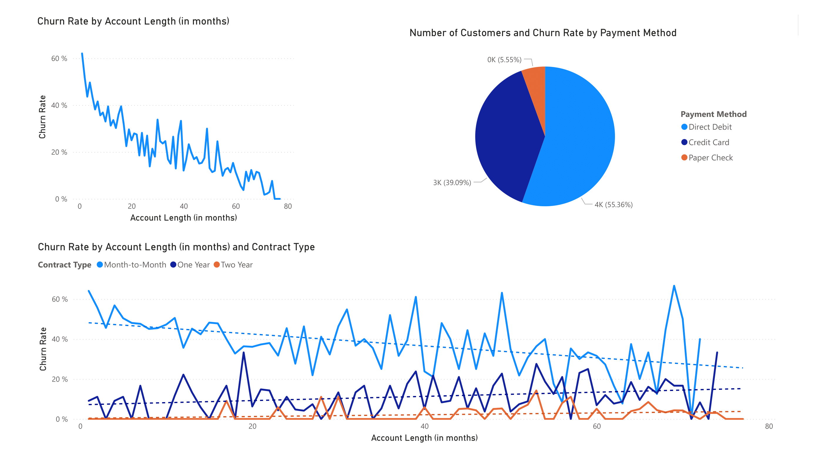
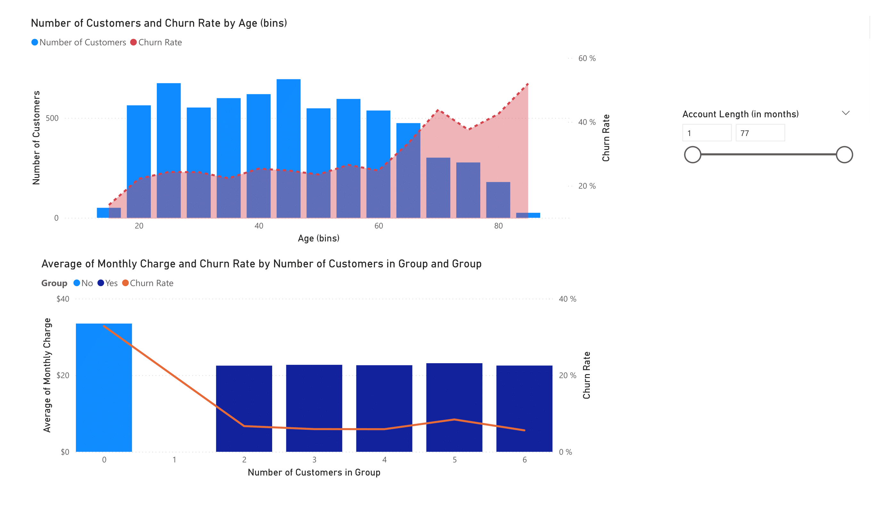
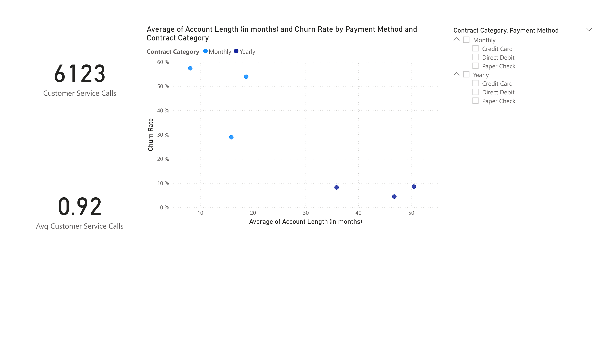
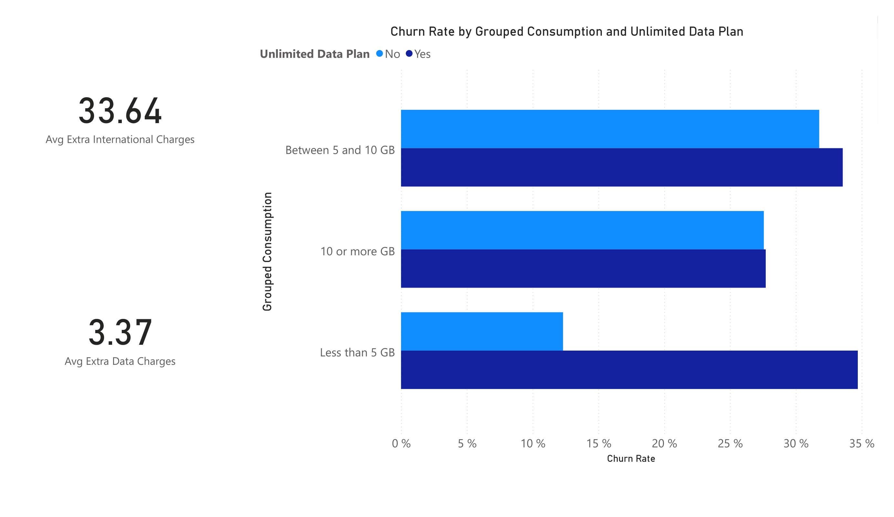
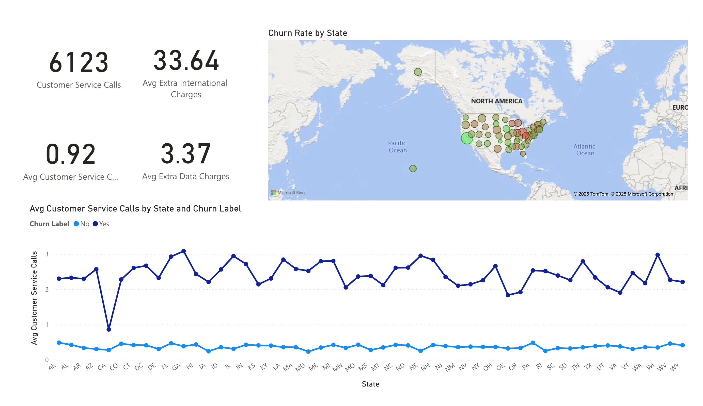

# 📊 Databel Churn — Power BI Report

This repository contains the final Power BI report built on the Databel churn dataset, plus a story-driven walkthrough of each page.  
It’s written to be skimmable by execs yet useful for analysts.

- **Report:** `Final_Report.pbix`
- **Data:** `Databel - Data.csv`

---

## 🔑 Executive Insights
- Churn is **front-loaded**: highest in the first few months, then steadily declines (survivorship).
- **Structure beats demographics**: **Month-to-Month** contracts (~46%) and **solo lines** drive most losses; **yearly/two-year** and **group plans** are naturally sticky.
- The **value gap** shows up for **Unlimited** (≈32% vs ~16% non-Unlimited) and for **5–10GB** users (peak risk): classic plan–usage mismatch.
- **International charges** (avg ~33.6) dwarf extra data fees (~3.4) → primary “bill shock” culprit.
- **Support friction** is decisive: churners average **~2–3 calls** vs **~0.3–0.6** for non-churners (4–8× gap) in every state.
- Geography is **mix, not destiny**: hotspots are states with more **intl-active** users + strong local competitors.
- **Payment** is a proxy: **paper check** is riskiest, **credit card** stickiest; direct debit in the middle.
- **Seniors** churn more (complexity/upgrade friction); under-30 cohorts are relatively stable.

---

## 1) Overview & Churn Reasons

Churn isn’t just about how many people leave—it’s who leaves and why. Older customers are more likely to churn, even though there are fewer of them. Most visible losses come from ages 30–60 (because that’s the biggest group), but risk per person jumps after 60. So we face two problems: mid-life customers leaving in large numbers, and seniors leaving at a higher rate.

People leave for two main reasons: competitors pulling them (better offers, devices, or value) and our own experience pushing them away (poor support interactions). It’s not mainly about high prices—it’s about how offers are framed and how customers feel after contact.

Seniors churn more likely due to confusing plans, upgrade issues, and less-friendly support. The big “Don’t know” group shows passive churn—small annoyances adding up. They’re great candidates for simple “stay” offers or personal follow-ups.

Fixing just two levers could save ~120 customers: winning back 10% of those lost to competitors (~61 saves) and improving service attitude to cut that churn by 30% (~59 saves). These gains would build over time.

---

## 2) Contracts, Groups & Churn

Churn isn’t about who the customer is—it’s about how they’re set up. Two things matter most: contract type and group size.

Customers with multiple lines rarely leave. Single-line users pay more but churn the most. Adding just one extra line drops churn to single digits and boosts total lifetime value. The goal isn’t bigger discounts—it’s getting that second line on the account.

Contract type has the biggest impact. Month-to-month customers churn around 46%, while yearly ones are only about 7%. Since over half the base is still month-to-month, that explains most of the overall churn.

Most leavers mention competitor offers, not pure price—rivals make switching easy with bundles and devices, especially for solo, month-to-month users.

If just 10% of those month-to-month customers moved to 1-year contracts, around 120 fewer people would churn, even before adding the group-plan benefit.

---

## 3) Usage × Plan (Unlimited vs Non)

Churn here is about value fit, not just how much people use.

Most churn comes from Unlimited plan customers—they make up ~67% of users and churn around 32%, about double the rate of non-Unlimited plans (~16%). That alone explains why total churn is near 27%.

The highest-risk group is mid-usage (5–10GB) customers. They churn ~33–35% because they sit in the middle: limited plans feel risky (overage worries), while Unlimited feels too expensive for what they use.

Light users (<5GB) stay loyal on non-Unlimited (~12–13%) but leave fast on Unlimited (~35%)—a clear sign of plan mismatch and poor value perception.

Heavy users (10GB+) churn less (~28–30%) since the Unlimited premium makes sense for them.

Overall, Unlimited likely signals other churn risks too—like month-to-month contracts or promo-chasing habits—so it’s not just about data use but customer type and expectations.

---

## 4) Geography × International Usage

Customers who use their phones internationally churn around 34%, versus 22% for others—a 12-point jump. This isn’t just about price; it’s about complex and unpredictable experiences with roaming, add-ons, and surprise charges.

On the map, most states look stable, but a few hotspots stand out. Those areas likely mix two churn drivers:

1. Strong local competitors with better device or plan offers

2. More travel-heavy users who face higher confusion or unexpected costs

In short, churn peaks where cross-border needs meet clearer rival offers. It’s not a simple coastal vs inland story—local competition and perception matter more than national averages.

International usage isn’t risky everywhere; it just amplifies churn when combined with strong local rivals and complex pricing. That’s why state averages can hide the real problem—local mix effects create the red hotspots.

---

## 5) Tenure, Contract & Payment Mix

The curve doesn’t just show that older customers churn less—it shows survivorship. People most likely to leave do so early, so the ones who stay longer are naturally more loyal. That’s why churn risk drops over time, even without any intervention.

Contract type sets the limits of that risk. Month-to-month customers always churn more than annual or two-year ones, no matter how long they’ve been around. You can reduce churn within a contract, but you can’t cross the gap created by structure. The small bumps in month-to-month churn suggest anniversary or promo effects—points where customers stop to reconsider.

Payment method reflects behavior more than cause.

Most use Direct Debit (~55%), then Credit Card (~39%), and a small group still use Paper Checks (~5–6%).

Check users churn most, credit-card users least, mainly because checks link to lower digital engagement, while card users are more self-serve and easy to reach.

Payment type isn’t driving churn—but it’s a strong signal of customer engagement.

---

### 6) Age & Household Effect

• Two churn engines: Mid-life (30–50) drives churn volume because it’s the largest group, while risk per person spikes after ~60, reaching 40–60%.

• Not just tenure: Even when filtered by account length, the late-life churn slope remains—so the age effect is real, not just a survivorship artifact.

• Solo premium vs. household lock-in: Single-line accounts pay the most per line and churn the most; at 2+ lines, churn drops to single digits and stays low while per-line charges stabilize.

## 7) Contract Clusters, Tenure & Support

The scatter shows two clear clusters:

Monthly customers: short tenure (under ~20 months) and high churn (30–60%).

Yearly customers: longer tenure (35–50 months) and low churn (5–10%).

Contract type drives the pattern—payment method only makes small differences within each group.

Support data adds context: 6,123 total calls (~0.9 per customer) means most people rarely contact support, so churn isn’t caused by frequent interactions. Instead, it’s structural and front-loaded—mainly new, month-to-month customers.

A small group of high-contact customers make many calls and churn at very high rates. The average hides this risky tail.

---

## 8) Charges × Usage × the “Unlimited” Promise

“Unlimited” isn’t a full safety net—it removes data overage worry, but not international fee shocks, which are the real churn driver.

The difference is huge: average extra international charges (~$33.6) are about 10× higher than extra data charges (~$3.4). So when bills surprise people, it’s usually from international use, not domestic data.

Looking at usage and plan type:

• Light users (<5GB): Hardly use data, yet Unlimited churns ~35% vs ~12–13% for limited plans — clear value mismatch.

• Mid users (5–10GB): Churn peaks (~33–35%) for both plans—too much for limited, not enough to justify Unlimited.

• Heavy users (≥10GB): Churn drops (high-20s) since the Unlimited premium finally feels worth it, though international fees still hurt.

---

## 9) State Hotspots, Charges & Support Friction

What looks like a regional churn pattern is really behavioral.

The map shows hotspots, but the line chart explains them:

• Churned customers make 2–3 support calls on average per state.

• Non-churners make only 0.3–0.6 calls.
That’s a 4–8× difference, consistent everywhere. So churn isn’t about location—it’s about frequent support contact.

The cost of that friction shows up in the tiles: international bill surprises (~$33.6) are much higher than data overages (~$3.4). States that “glow red” are those with more international users and more repeat support calls.

The non-churner call line is flat across states—steady and low. Geography doesn’t cause churn; it just changes the mix of high-friction, travel-heavy customers.

---

## 🔎 Summary (what’s really driving churn)

- Front-loaded churn: Risk is highest in the first months, then decays (survivorship effect).
- Structure beats demographics: Month-to-Month (~46% churn) and solo lines drive losses; yearly/two-year and group plans are naturally sticky.
- Value gap (Unlimited & usage): Unlimited ≈32% vs non-Unlimited ~16%; 5–10GB users are peak risk → plan–usage mismatch + promo chasing.
- Bill shock driver: International charges (~33.6) dwarf extra data fees (~3.4).
- Support friction signal: Churners average ~2–3 calls vs ~0.3–0.6 for non-churners (4–8× gap).
- Geography = mix, not destiny: Hotspots are states with more intl-active customers plus strong local competitors.
- Payment as proxy: Paper check is riskiest, credit card safest, direct debit in between.
- Age effect: Seniors churn more (complexity/upgrade friction); under-30 cohorts are relatively stable.

---

## ✅ Recommendations
1) Shift the contract mix (highest impact)
   - Who: Month-to-Month customers, especially in first 6–12 months.
   - What: Targeted nudges to 1-year terms at upgrade/billing moments (bundle-based, not price-only).
   - Why: Contract sets the ceiling on risk; even at long tenure, M2M never converges to annual churn.

2) Grow households, not lines
   - Who: Solo accounts.
   - What: “Add a line” offers (family/partner bundles, small device credits).
   - Why: The second line collapses churn into single digits; household LTV jumps even if ARPU/line softens.

3) Fix the 5–10GB “no-man’s land”
   - Who: Users averaging 5–10GB (both plan types).
   - What: Introduce a mid-tier or rollover/auto-step-up option; simplify message: “never overpay, never overage.”
   - Why: This band is the peak risk across plans.

4) Right-size Unlimited (stop the mismatch)
   - Who: Unlimited + <5GB users.
   - What: Proactive plan right-sizing outreach; make it positive (“save without losing peace of mind”).
   - Why: Unlimited underperforms badly for light users → perceived unfairness.

5) Kill international bill shock
   - Who: Intl-active customers and hotspot states.
   - What: Travel passes/caps, pre-travel texts, in-bill alerts, and post-trip credits rules; make intl fees transparent at signup.
   - Why: Intl charges are the largest surprise cost and add ~12pp churn lift.

6) Triage repeat-contact customers
   - Who: ≥3 support calls in 60–90 days.
   - What: Auto-route to a save queue, empower agents with small make-goods and plan fixes; track save rate.
   - Why: The callers vs. non-callers churn gap is 4–8× in every state.

7) Onboard like it matters (first 90 days)
   - Who: All new/M2M signups; concierge lane for seniors.
   - What: Welcome sequence, bill preview, device/plan setup help, “what to expect” on intl/data.
   - Why: Most churn happens early; seniors especially need clarity over complexity.

8) Payment method hygiene
   - Who: Paper check and (where risky) direct-debit cohorts.
   - What: Incentivize card autopay (rewards, fee waivers); make switching trivial.
   - Why: Payment is a strong behavioral proxy for stickiness/contactability.

9) Compete where it counts
   - Who: Hotspot states; M2M + solo + Unlimited-light users.
   - What: Competitor-parity bundles (offer + device + protection/backup), localized to rival promos.
   - Why: Stated reasons are dominated by competitor offers/devices—win the promise, not just the price.

10) Coach the “moment of truth”
   - Who: Frontline support.
   - What: Train for empathy + first-contact resolution; QA on tone and ownership; small discretionary credits.
   - Why: “Attitude of support person” is a top reason; one bad call undoes any pricing story.

---
